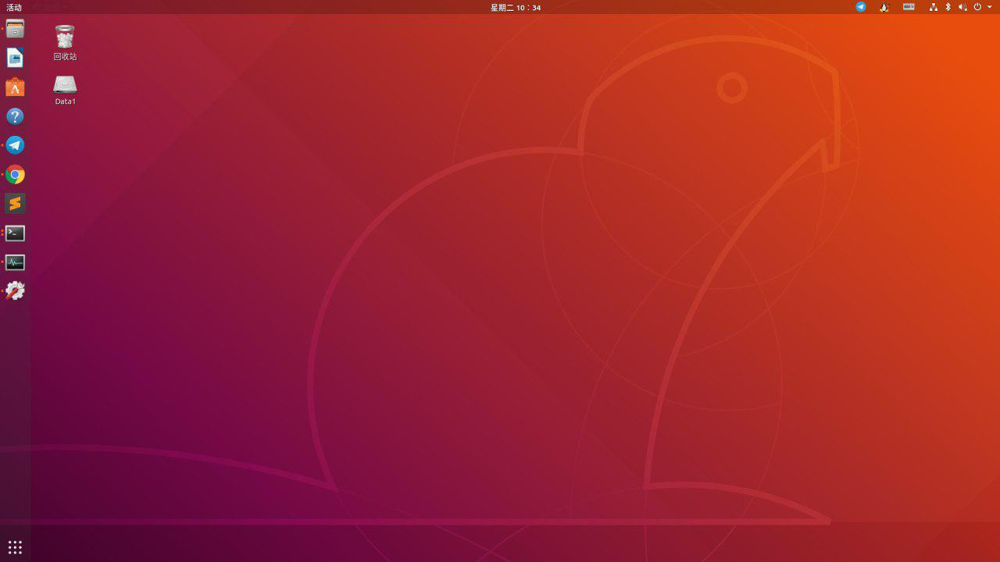
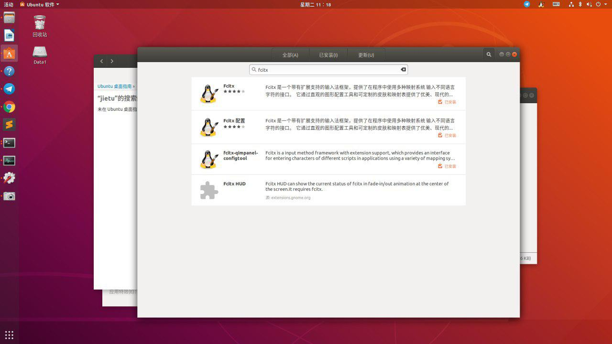
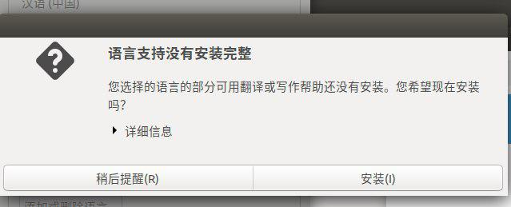
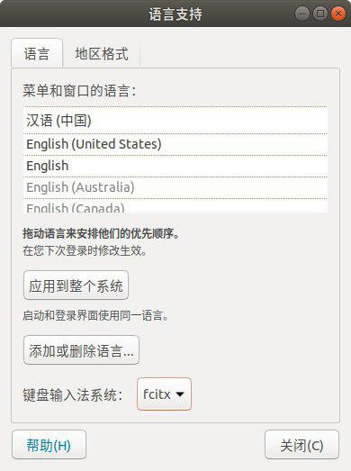
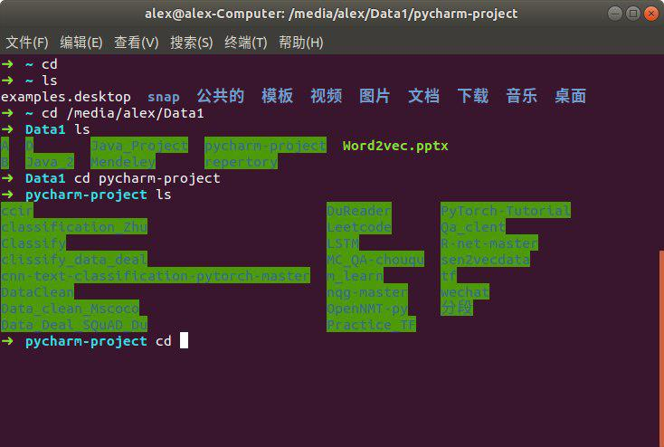
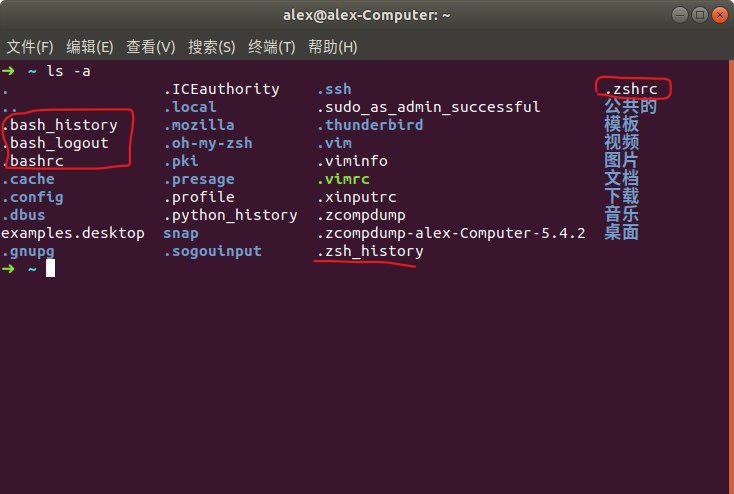
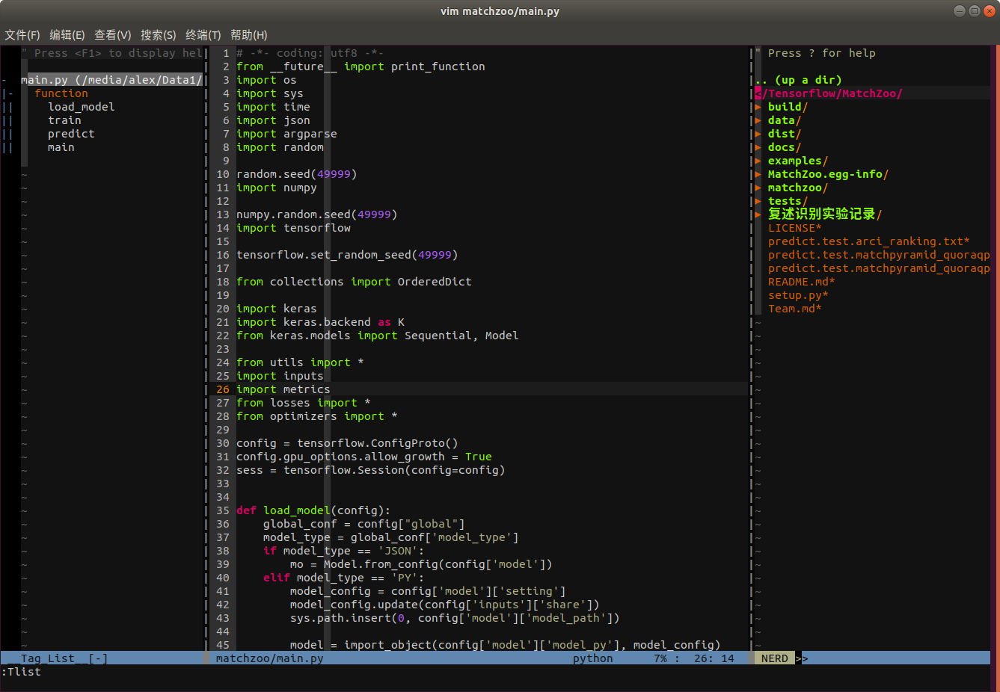
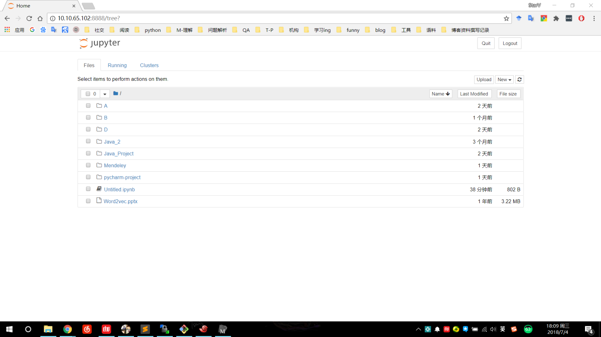

日常工作是一台Linux台式机+windows笔记本。Linux系统我一向是以Ubuntu为主，今天主要想记录一下Ubuntu安装配置的相关记录。PS: 正好嫌弃之前的环境配置的比较乱，而且有了Ubuntu18.04，所以准备重装升级一下。

## Ubuntu系统安装

### 安装准备

* 数据备份，良好的数据备份习惯可能在很多重要的时刻拯救你！
* U盘启动盘制作
> * [系统下载](https://www.ubuntu.com/download/desktop)
> * 制作U盘启动，百度一下会有很多相关教程，这里我直接提供Ubuntu官方提供的[U盘启动制作教程](https://tutorials.ubuntu.com/tutorial/tutorial-create-a-usb-stick-on-windows#0), 该教程是在Windows系统上制作U盘启动，其中有Ubuntu系统与Mac系统上制作U盘启动的教程。
> * 通过U盘启动盘安装，该安装教程仍然可以从Ubuntu[官网](https://tutorials.ubuntu.com/tutorial/tutorial-install-ubuntu-desktop#0)查看到，同时百度一下，网上有很多教程，这里就不详细叙述了。

在简单使用了一下之后，不得不说，18.04版本的确在一些方面有了很大的升级。最重要的就是它的**Ubuntu软件**，之前版本的Ubuntu，软件中心基本就是摆设，没有多少可用的软件，但是18.04版本的Ubuntu要丰富些，而且感觉安装软件的时候也快捷一些。

## Ubuntu环境配置

在安装完成Ubuntu之后，我们需要配置一些我们需要的工具，环境等，该有的软件更新先更新一下。

### 输入法配置

习惯了各种灵活快捷的中文输入法，再使用Ubuntu系统自带的中文输入法的确是让人头疼的一件小事。 这里讲述一下，如何安装配置搜狗输入法。
> * 下载搜狗输入法的[Linux版本](https://pinyin.sogou.com/linux/?r=pinyin)。我这里下载的是64位的版本。
> * 先不要双击安装，打开应用商店，搜索fcitx，将搜索到的所有小企鹅图标都安装。

> * 安装好fcitx之后，在双击搜狗输入法安装包安装，之后在终端输入**sudo apt remove ibus* **，将ibus输入法删除。
> * 打开设置区域和语言，管理已安装的语言。点击会出现一个安装选项，选择稍后提醒，不用点击安装

在将语言支持中的键盘输入法切换成fictx，重启电脑，搜狗输入法就可以使用了

### zsh配置

Ubuntu自带的是bash, zsh是bash的增强版，显示比bash更友好。

* 安装zsh,命令：
apt-get install zsh

* 修改默认的Shell，将其从bash转到zsh， 命令： 
chsh -s /bin/zsh

* 配置密码文件（PS: 最好一开始先备份/etc/passwd），将第一行**/bin/bash**改成**/bin/zsh**,命令：
sudo vi /etc/passwd

* 效果如下

* 注意，安装了zsh之后，之后如果涉及到一些shell配置，需要修改的是主目录下的隐藏文件 **.zshrc**

### vim配置

Vim，对于广大代码编辑工作者来说都是不陌生的。我事实上也并不是对vim操作特别熟练于心。这边主要是配置一下vim，使得vim更加友好。
 * 第一步是安装vim，在终端输入vim如果没有，系统会提升安装的命令。
 * 配置vim这里采用了一个非常简单的操作，将我分享的两个文件 **.vim** 与 **.vimrc** 直接复制到用户目录下就可以了
 [百度云盘链接](https://pan.baidu.com/s/1RSTODGDr3IuPH6p2Oj9Vkw), 密码: ytqv
 * 效果如下图所示
 

两个主要的命令，
 > * NERDTree，显示目录，如上图右部分所示。
 > * Tlist, 显示代码的函数列表，如上图左部分所示。

 显示的目录和函数列表，鼠标点击能够跳转。还有其他命令操作可以自己探索~

### anaconda安装
现在机器学习，自然语言处理中都使用到Python，Ubuntu18.04自带安装好的Python2.7 与 Python3.6。这里推荐安装anaconda是因为anaconda能够方便管理Python环境等一系列优点。
安装步骤：
 * 下载 [官方链接](https://www.anaconda.com/download/#linux)
 * 直接运行 bash Anacondaxxxxxxxx.sh

新建环境：
> conda create -n 环境名字 python=X.X (2.7,3.6)，环境名字可以在Anaconda安装目录envs文件下找到。

激活环境：
> source activate 环境名字

关闭环境：
> source deactivate

删除环境：
> conda remove -n 环境名字 --all

克隆环境：
> conda create -n 环境名字 --clone 已有的环境名

### 配置Ubuntu18.04软件源
Ubuntu软件源，配置成国内的软件源，在软件更新的时候速度更快。

具体操作，依照以下的博客进行操作，主要是在 /etc/apt/source.list文件中添加国内源。

[Ubuntu添加软件源](https://blog.csdn.net/shanpenghui/article/details/80433555)

### 配置jupyter
jupyter能够方便的远程连接调试代码，这里简单记录一下它的配置，使得使用笔记本能够连接到ubuntu上的jupyter。

* 在终端运行 `jupyter-notebook --generate-config`, 会在用户目录下生成隐藏文件 `.jupyter/jupyter_notebook_config.py`
* 编辑该文件，修改三个地方，vim打开jupyter_notebook_config.py
 * 修改Line：174， 将 **c.NotebookApp.ip = 'lockhost'** --> **c.NotebookApp.ip = '*'**
 * 跳转到Line: 226, 能够看到一行代码 `from notebook.auth import passwd; passwd()`,该行代码是生成密码的函数，打开Python输入代码，会生成一行密码
 * 将生成的密码复制到 Line: 229行， `c.NotebookApp.password= '密码粘贴处'`，注意该行的注释
 * 将Line：220行中的 `True` 改成 `False`, 这样，笔记本调用jupyter的时候，本地不会打开浏览器界面。
使用：
* 在Ubuntu上终端输入：`jupyter-notebook`
* 在笔记本浏览器上输入： `http://10.10.65.102:8888/` ip+端口
最终效果如下：
