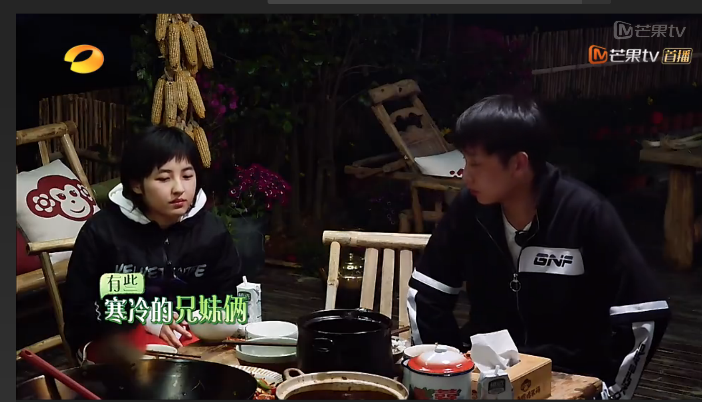
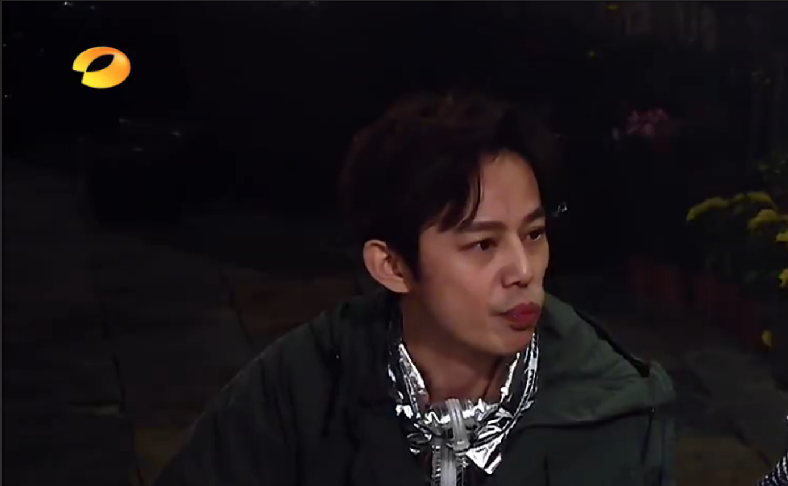
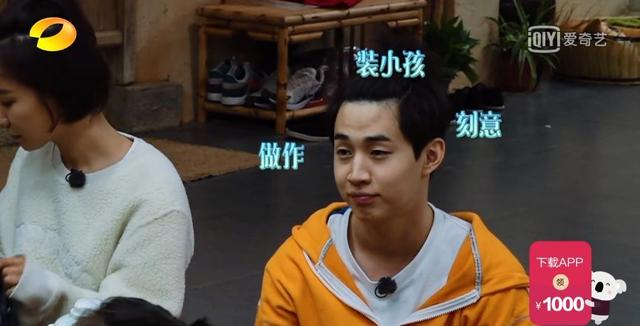
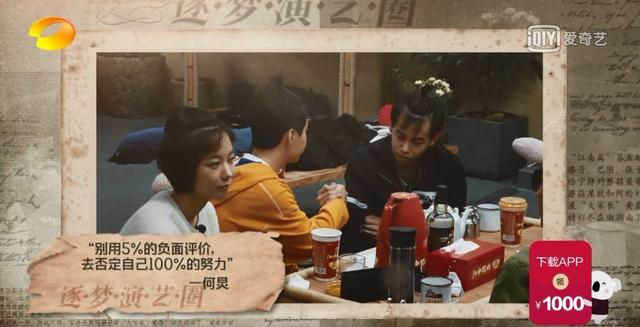
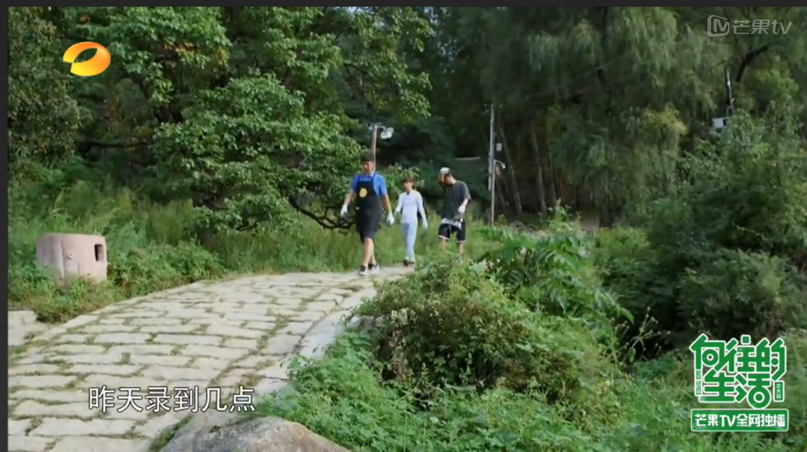
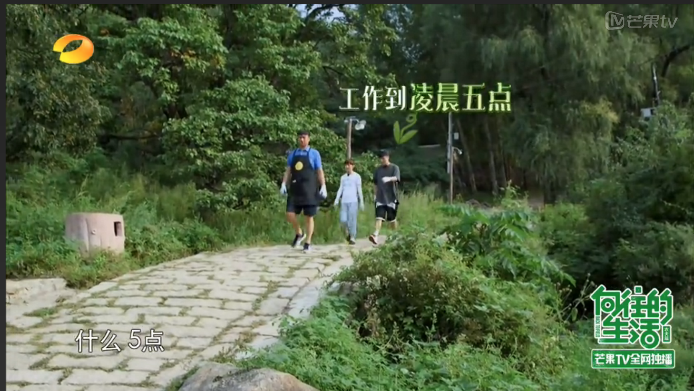

《向往的生活第2季》已播放到了第七期，品质依旧，精彩不减。这档主打田园生活的慢综艺，一开播，就圈粉无数。确认过眼神，是很下饭的综艺～～作为娱乐圈公认的高情商，何老师的情商在这档节目中再次被放大，娱乐圈最会说话的综艺节目主持人，何炅，没跑了～

第二季向往的生活，宋丹丹和巴图再次做客，这一期的嘉宾还有小童星张子枫，吃晚饭的时候，张子枫因为穿着单薄，冻得打了个哆嗦，细心的何老师发现了，立马跑回屋给子枫拿了件外套穿上。

还是这一集，一伙人吃完晚饭回屋聊天玩游戏，Henry大华说到自己在微博上被人吐槽做作、装小孩、刻意，自己觉得很难过，回觉得对不起观众。

何炅听了立马收起刚刚开玩笑的态度，一下子认真起来，告诉henry：除了不好的评论，但我会看到一万条好的评论，说刘宪华太可爱了，这样就够了。

行走娱乐圈几十年的黄磊，在面对网络暴力的时候，也有被击垮的瞬间。黄老师在聊到《深夜食堂》时，坦言被网友喷的体无完肤，受到了血雨腥风似的批判。一千个人眼中有一千个哈姆雷特，谁都不能活成每个人喜欢的样子。既然作为公众人物就难逃被人们评价的宿命，那当事者不如就干脆放宽心，像何老师说的，别人要是说对了我就改，别人要是说错了，那我就自我勉励。“别用5%的负面评价，去否定自己100%的努力。”

在第一季节目中，有一次陈赫来做客，狮子大开口，一下点了个佛跳墙，但是来到蘑菇屋后，啥活也不干，黄磊大华一指挥他干活，他便找理由推脱～～后来，为了尽快完成欠了节目组的玉米，陈赫也加入了摘玉米大军。路上，何老师问他昨晚录到几点，陈赫回答录到了凌晨五点。何老师看似平常的问候，其实也是为了保护陈赫，怕他被网友吐槽好吃懒做。毕竟，网络暴力的可怕程度会超出我们的想象～

网友们这样评价何老师，“他是唯一一个能全面照顾到人的艺人，而且从不生气甩人面子，人前人后性格一样（艺人里口碑太好），说白了何老师其实是完美老好人。”“照顾到身边的每一个人，让每一个人都感觉到舒服与尊重。”“他讲话方式让每一个人都很舒服，而且还不失分寸。”

如果我们身边有很多像何老师一样会说话、爱照顾人的朋友，这也是一种向往的生活吧！
