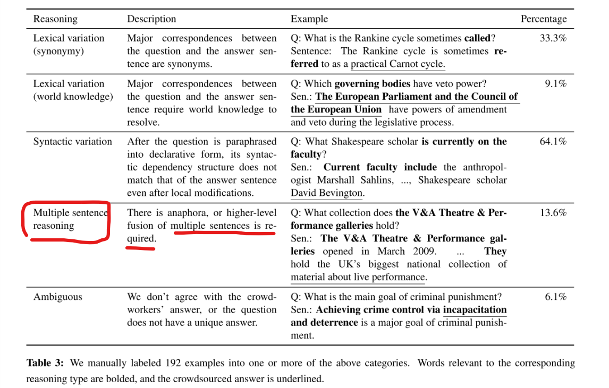

## 实验说明
按照导师要求，使用texttiling技术对squad语料中的段落进行切分，将长段落切成多个小段落，重新构造语料进行R-net模型的训练。

**动机：**
 
 - 一个长的段落， 一个短的段落，显然从长段落中抽取问题的答案要难些，为什么？
 - 我们分析，squad语料上的模型在最后一层输出层，是对段落中的每个词计算两个概率--答案的开始 、答案的结束。 段落长，单词多，要计算比较的概率值就多，段落短，计算比较的概率值就少。
 - 补充：然而我并不看好。（我给出可能失败的理由，然而仍然要用实验去证明） 
 
 <!-- more -->
 
**实验结果：**
 
- 我在两个模型上进行相应的测试，[R-net][1] 与 [bidaf][2]

|语料|r-net|bidaf|
|:---:|:---:|:---:|
|原始squad|EM:70.39 F1:79.14|EM:67.7 F1:77.3|
|tiling squad|EM:68.38 F1:77.10|EM:60.65 F1:72.12|
|结果|-2.01 -2.04|-7.05 -5.18|

**第一次结果分析：**

> 我们清楚的看到，在r-net与bidaf上，使用texttiling切分段落后的语料训练的模型，整体性能都下降，bidaf模型整体性能大幅下降。具体原因是什么呢？看下图(这是我一开始给出的可能会导致失败的理由！！！)：

> 我们能看到，该图表明，squad语料中有一定规模的问题答案是需要多句推理才能得到答案，而是要texttiling切分之后，这中类型的分布招到了破坏。

我们进一步分析，为什么bidaf下降这么多，r-net下降这么少？

> 这是因为，bidaf中使用了**双向注意力机制**，该注意力机制是分别从问题方向、段落方向进行注意力矩阵权重，在获得问题与段落的表示，当整体段落被切分之后，对于需要多句推理的段落亦或是上下文紧密相关的段落，双向注意力机制的计算受到了破坏。
而在r-net中，使用的是**二层注意力Interaction模式**，虽然第一层使用了问题到段落方向的注意力计算，获取融合问题信息的段落表示，texttiling切分也会破坏它的表示计算，但是在第二层对段落使用了自注意力机制，使得能够重新聚焦到答案附近的表示。这应该就是，为何r-net下降比bidaf低的原由。

## 导师要求在不同类别上进行测试(我只做了r-net，结果很明显)

**未切分训练的模型在未切分的dev测试结果**

|指标|what|which|when|how|where|why|who|other|ALL|
|:--:|:--:|:--:|:--:|:--:|:--:|:--:|:--:|:--:|:--:|
|个数|4745|454|695|1090|431|151|1059|1945|10570|
|F1|76.78|78.28|87.68|78.50|76.31|70.63|83.74|81.18|79.14|
|EC|67.04|71.15|83.88|67.61|66.13|42.38|79.41|73.32|70.39|

**tiling训练的模型在tiling-dev上的性能测试**

|指标|what|which|when|how|where|why|who|other|ALL|
|:--:|:--:|:--:|:--:|:--:|:--:|:--:|:--:|:--:|:--:|
|个数|4987|486|716|1147|448|158|1116|2036|11094
|F1|74.92|75.73|87.82|75.77|72.44|64.96|81.15|79.51|77.10|
|EC|65.21|68.11|83.38|66.61|59.38|39.87|76.61|71.61|68.38|

**以上两者数据比较（以未切分模型数据为基准，看tiling训练的模型性能）**

|指标|what|which|when|how|where|why|who|other|ALL|
|:--:|:--:|:--:|:--:|:--:|:--:|:--:|:--:|:--:|:--:|
|F1|-1.86|-2.55|+0.14|-2.73|-3.87|-5.67|-2.59|-1.67|-2.04|
|EC|-1.83|-3.04|-0.5|-1.0|-6.75|-2.51|-2.8|-1.71|-2.01|

[1]: https://github.com/HKUST-KnowComp/R-Net
[2]: https://github.com/allenai/bi-att-flow