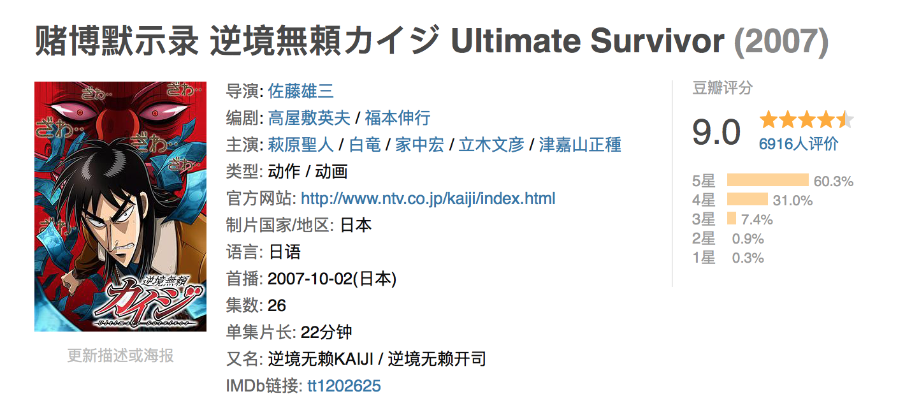
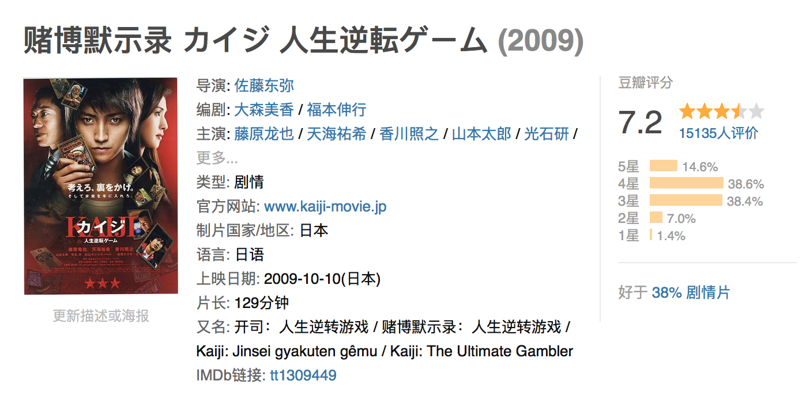

今年的暑期档，异常火热。6月29日低调上映的《动物世界》打响了暑期档的头枪。这一枪，很成功。当《一出好戏》的黄渤抢着综艺，《邪不压正》的姜文赶着路演，《我不是药神》的徐峥忙着电影节，韩延和李易峰并未高调地吆喝作品，《动物世界》就这样被上海电影节默默选为了开场电影。认真讲，这部国产品，看的很过瘾。

**拿来的好故事，电影没有讲烂**
《动物世界》改编自日本福本伸行的青年漫作品《赌博默示录》，暗黑系烧脑神作。在日本，漫画很早就被动画化、电影化，豆瓣评分都还不错。当它遇到韩延后，很庆幸，没有被改烂。

韩延，上一部电影还是三年前口碑爆棚的《滚蛋吧！肿瘤君》，一个追求慢功出细活的导演，没有理由拍不好一个好故事。
简单来说，电影讲的是拿命作为筹码，通过赌博胜利存活下来的悬疑人性故事。
————————【前方大量剧透，如有不适请绕道电影院】————————
李易峰饰演的男主郑开司是个数学天才，而这份天赋，遗传了身为数学老师的父亲。然而在开司8岁时，一群黑衣人突然闯入家中，带走了父亲，留下了被吓成植物人的母亲和年幼的自己。从那以后，开司的精神受到了打击，遇到惊险时脑中会出现小丑模样，而自己，因为要照顾植物人妈妈，从此浑浑噩噩长大，生活窘迫，成了他人眼中的小丑。

为了让妈妈有好的住院条件，为了能够娶到自己青梅竹马的暗恋女孩，开司相信了发小抵押房产换钱的承诺，将自家两百多万的房子交给了发小，电影都是戏剧的。发小把房子卖给了高利贷，自己又在澳门输光了。于是，开司莫名背上了几百万的债务，被一群神秘组织抓去，登上了一个名为“命运号”的邮轮，在这个不受国际不受法律制约的邮轮上，开司将和一群来自世界各地的人赌博，获胜的人才能获得下船的资格。

这是一场拼智商斗人性的较量，而筹码是自己的生命。

关于智商，由于本博主智商有限，在观看男主超高能力的推理博弈时，一直处于断片状态，哈哈，所以我放弃描述。。详细内容请至电影院观看。
关于人性，男主开司虽然生活窘迫，碌碌无为，因为穷，他都不敢向自己暗恋多年的青梅竹马表白求婚。然而，看似生活loser的他，却有着自己坚信的道：
“那美好的仗我已经打过，该走的路我已经走到尽头，但老子信的道，老子自己来守。”
这段台词整部影片一共出现三次，刚开始出现时，博主没看懂，而当开司赌博胜利再次被发小及同伴背叛时，他怒了。因为念及发小情谊，他答应帮助骗了自己房子的李军走出邮轮；因为看到胖子家有幼女，心肠一软，承诺互相信任，一起下船。然而，在最后的赎人环节，脆弱的人性还是抵不住金钱的诱惑，于是，核心自白出现：
“那美好的仗我已经打过，该走的路我已经走到尽头，但老子信的道，老子自己来守。”
他走出了黑房间，从两人手中夺回属于自己的星星和金钱，又赎回了黑房间内的老人，用救世主般的光环打脸了毫无人性的发小和胖子。

**年过三十的“小鲜肉”，渴望突破**
本片除了剧情和特效，另一大亮点就是男主李易峰。这个年过三十的“小鲜肉”，面对新生代力量的崛起，不得不思考未来的路往哪儿走。
**没有作品，没有年龄优势，就会被时代抛弃。**
**这是每一个流量明星的特点，也是流量明星转型必须突破的难点。**
李易峰的这一次突破，可以说成功了，虽然在电影中的演技仍有不足，但整体没有出错，该用力的表演也用力了，剩下的，就需要他用更多的作品来磨练演技，直到让大家知道他是一名真正的演员。
**还记得一年前，在成龙动作电影周之夜的颁奖典礼上，李易峰一袭白色西装上台发言，他微笑着说要用“素颜ppt打动观众”，一年后的现在，他带着邋遢造型的《动物世界》出现在观众视线，用实际行动向观众展示了自己的素颜ppt，一年前的flag，李易峰，立住了。**

本片的结尾故事还将继续，神秘组织再次出现在开司的生活中，植物人妈妈没有醒来，失踪的爸爸到底去了哪里？“你果然有父亲的影子。”神秘人留下的这句话是否表明父亲与这个组织有着联系？同为数学天才的父亲是否就是整个赌博游戏的设计者？《动物世界2》，值得期待。