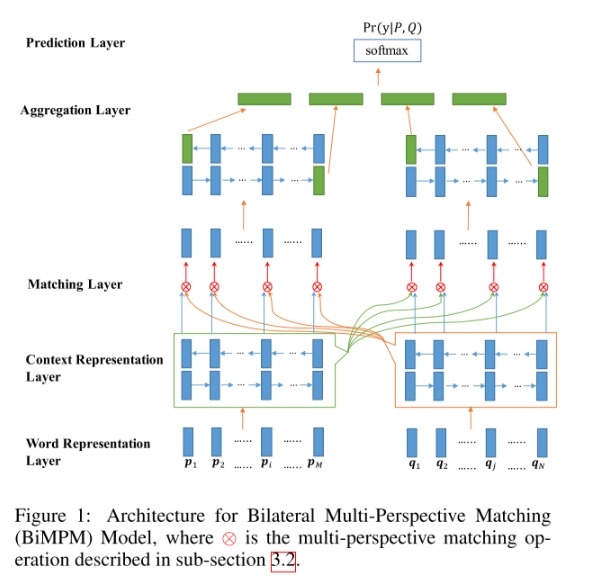
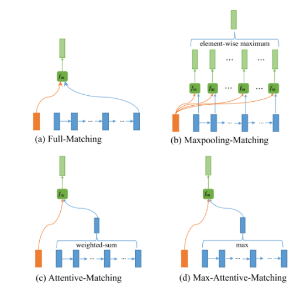
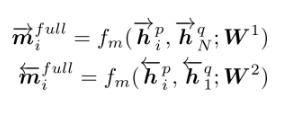
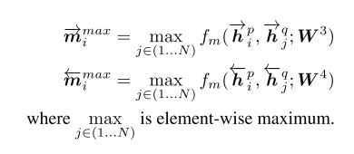
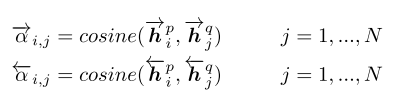
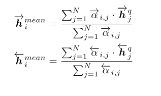
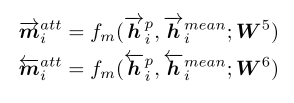
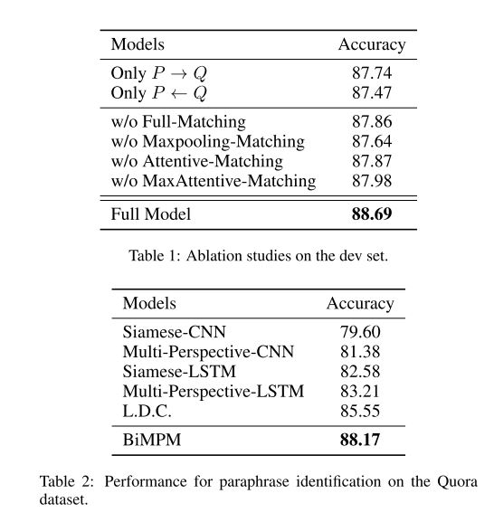
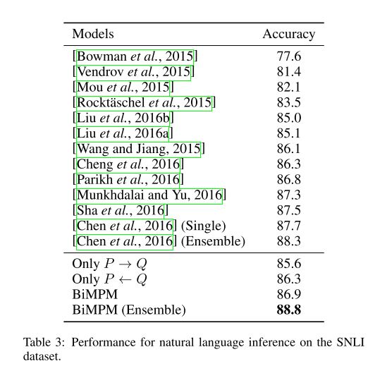
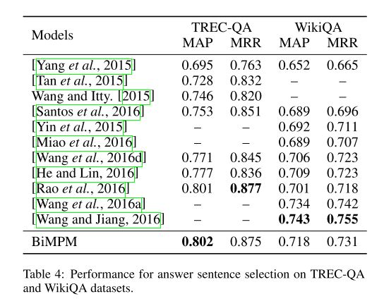

## 介绍
该论文是IBM研究员[王志国][1]在2017年投稿在IJCAI上的工作，文章主要是针对句子匹配提出了一个新颖的模型，今天我将对这篇论文做个学习笔记，该论文工作我也想到了，我是从阅读理解模型上受到启发的，实验做了一小半的时候读到了这篇论文，很可惜只能另想点了。

## 任务
Natural language sentence matching (NLSM)主要就是比较两个句子并识别他们的关系，适用多个任务

1. Paraphrase Identification (PI) ：判断两个句子是否表达同样的意思（identifing whether two sentences express the same 

2. Natural Language Inference (NLI) ：也叫Recognizing Textual Entailment(RTE)，判断两个句子在语义上是否存在推断关系，相对任务一更复杂一些，不仅仅是考虑相似，而且也考虑了推理。

3. Question Answering (QA) ：主要是指选择出来最符合问题的答案，是在给定的答案中进行选择，而不是生成

## 动机分析
本文在开始的Introduction提出在NLSM任务上对之前任务给出了两个框架

- “Siamese” 
  架构：使用相同的神经网络encoder对输入的两句话进行编码成句子向量，再对两个句子进行一个匹配预测处理，例如两个句子向量进行点乘，余弦，欧几里得距离计算，再softmax得出结果。
   优点：参数共享（两个句子编码层）是模型更小，训练更快。
- “Matching aggregation”
  架构：由[Wang and jiang, 2016][2]提出，先对输入的两个句子进行匹配处理，之后再将匹配结果聚合到一个向量中，最后做最终结果处理(softmax之类)
  优点：捕获两个句子之间更多的交互特征。
  缺点：**两个句子之间的匹配不充分，只有词与词，短语到短语，单个方向上的匹配**

本文提出的模型属于第二类框架，并且基于第二个框架上缺点之上，给出的一个更加完善的架构，主要核心在于两个句子之间的匹配。

个人分析：该文提出的架构，类似于阅读理解上的模型，例如BiDAF，对输入的两句向量表示，做了两个方向上的匹配处理，在做最终的处理，基本架构一致。

## 模型框架

该模型分层五层

1. Word Representation Layer
   目的：输入的处理
   输入：P - Q (分别表示两句话)
   处理：预训练glove词向量+字符级向量(随即初始化，训练调整) --> LSTM
   输出：P [p1, ... , pm] Q [q1, ..., qn]

2. Context Representation Layer
   目的：对句子进行编码
   输入：上层的两个P 与 Q
   处理：P + Q --> BiLSTM = H [h1,...,hm] [h1,...,hn]

3. **Matching Layer**
   目的：对上层LSTM输出的P Q 隐藏层进行匹配处理
   输入: [h1,...,hm] [h1,...,hn] (m-P, n-Q)
   处理：有以下如图所示的四种处理方式
   

4. Aggregation Layer
   目的：将匹配层处理好的P与Q向量聚合到一个固定长度的匹配向量之中
   输入：[M1,...,Mm] [M1,...,Mn] 分别是匹配处理后的表示
   处理：[M1,...,Mm] + [M1,...,Mn] -->BiLSTM = MV(固定长度的匹配向量）

5. Prediction Layer
   目的：计算最后的概率分布 Pr(y|P,Q)
   输入：MV
   处理：MV --> 2层前向传播网络 --> softmax = Pr(y|P,Q)

## 模型匹配层分析
该层是本文模型的核心，在阅读理解的多个模型中，匹配层也是核心，只不过阅读理解模型上多个各种新颖的注意力机制进行匹配处理计算。下图值画了一个方向的P -> Q，实际中还有Q -> P操作

1. Full-Matching
顾名思义，全匹配，如图a所示一样，将P在上层LSTM输出的隐藏层每一个hi与Q在上层LSTM最后输入的hn做计算，计算方式如下,因为是双向，所以这里也计算两个方向上的匹配矩阵

2. Maxpooling-Matching
如图b所示，图中清晰地表明了如何操作，不同于Full-matching模式，这里将P与Q在每一个时刻的上一层的隐藏层输出做相应计算，并且在每一维度上取max,计算公式如下:

3. Attentive-Matching
如图c所示，这理使用的是注意力机制，先计算了P与Q之间的注意力权重，然后调整Q表示之后，在来一个类似full-matching的计算。

 在注意力矩阵计算好之后，重新调整Q的表示

 接着，开始最后的计算，

  
4. Max-Attentive-Matching
如图d所示，该策略类似Attentive-Matching，唯一的不同是注意力权重的使用上，Attentive-Matching是利用注意力权重相乘，这里是取权重矩阵值最大的那一列数据，简单的说，有点类似soft attentiion 和 hard attention, 策略3 就是soft-attention, 这里就是hard-attention

## 实验结果
本文在实验上做了很多工作，在不同语料上做了各种对比，同时，针对模型匹配层提出的4中方式，都相应做了实验对比，同时还对比单方向计算和双方向计算的实验，证明了本文提出进行两个方向计算的必要性。

## 个人总结
Natural language sentence matching 是可以复用很多阅读理解任务上的经验，都是对输入的两段自然语句进行处理，只不过阅读理解任务上是一个句子+段落的输入，而句子匹配是两句话的输入，本文可以说是很好复用了阅读理解相应的工作（个人理解，我从时间上推测，阅读理解模型bidaf是16年发表在ACL，本文是17年下半年），我在阅读理解上的研究陷入困境（阅读理解任务很需要硬件资源，也不是适合一个人做的，而且竞争激烈，谷歌，阿里，腾讯，Facebook等大公司在竞争，现在进入到各种模型上的堆砌阶段），就想到将阅读理解的一些经验用在句子匹配上。另外，本文工作上可以说很充分，实验了3种语料上的性能，并且对比了自己提出模型核心上的4中方法性能。对于句子匹配任务，有新的一篇论文COLING2018《Neural Network Models for Paraphrase Identification, Semantic Textual Similarity, Natural Language Inference, and Question Answering》更好的探索了这一领域，虽然已经有人做了相应的[论文笔记][3], 但是对于我认为最重要的现象分析没有多做解释，我将在下一篇笔记里介绍。

## 补充
[作者主页][4]
[code][5]

[1]: https://www.ijcai.org/proceedings/2017/579
[2]: http://xueshu.baidu.com/s?wd=paperuri%3A%288978eef927945be5b64494c8bd4e3388%29&filter=sc_long_sign&tn=SE_xueshusource_2kduw22v&sc_vurl=http%3A%2F%2Farxiv.org%2Fabs%2F1611.01747&ie=utf-8&sc_us=15995814480716425477
[3]: http://www.paperweekly.site/papers/notes/411
[4]: https://zhiguowang.github.io/
[5]: https://github.com/zhiguowang/BiMPM