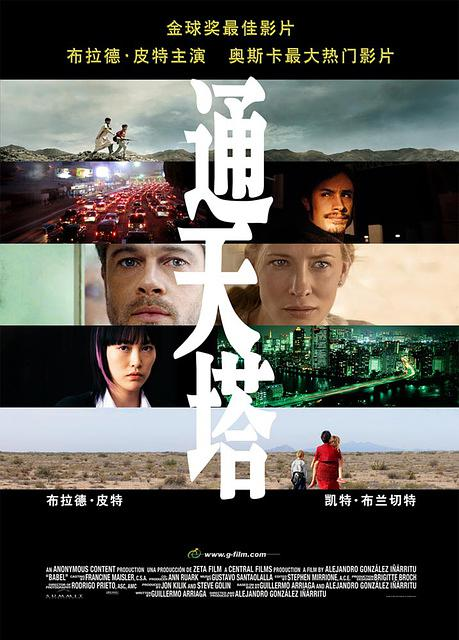
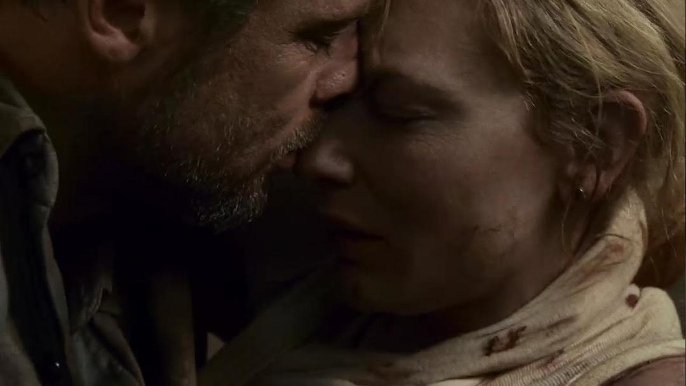
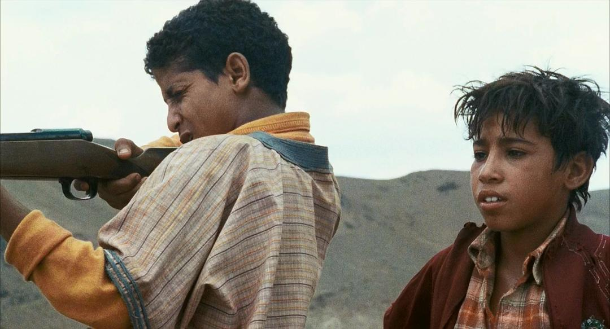
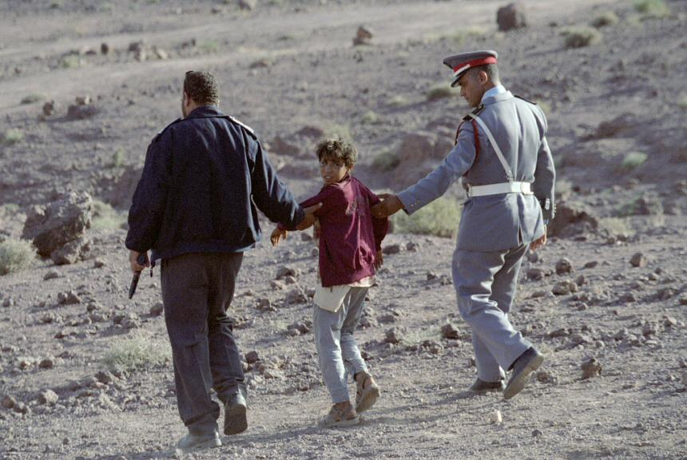
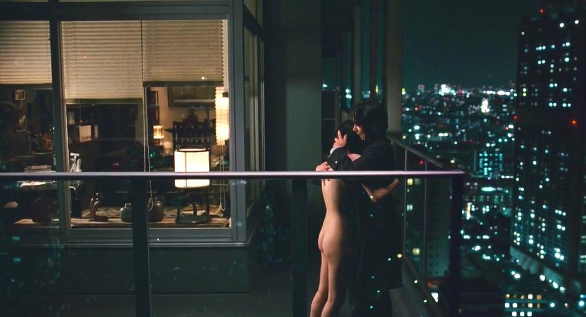
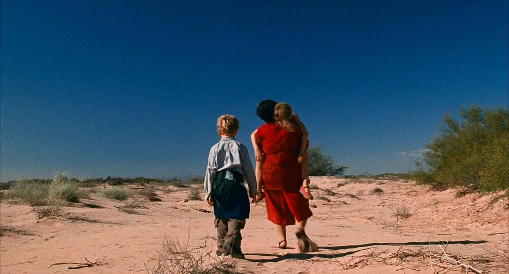

第87届奥斯卡金像奖，《鸟人》获得了最佳影片，导演亚利桑德罗·冈萨雷斯·伊纳里图同时获得了最佳导演。这不是导演亚历桑德罗第一次提名奥斯卡，今天要给大家安利的也不是获奥影片《鸟人》，而是亚历桑德罗在第78届奥斯卡金像奖上的提名影片《通天塔》。
<!-- more -->

《通天塔》有着典型的墨西哥风格及亚历桑德罗风格，与《爱情是狗娘》与《21克》并称“隔阂三部曲”，通天塔在圣经中的原意是指语言不通造成的隔阂，在电影中的含义则得到了扩充，其它因素成为了沟通最大的障碍。美国夫妇因为感情不睦，无法沟通，家庭面临破碎；日本聋哑女孩因为无法像正常人一样沟通，被同龄人排挤，无法享受正常的恋爱；墨西哥籍的美国白人保姆因为种族歧视，被美国警察当成幼童绑架嫌疑人扣押；摩洛哥小兄弟因为父母的爱与偏爱，都想抢风头证明自己，结果误伤来旅游的美国女主；美国女主被枪击中，因为语言不通，无法信任为自己治疗枪伤的摩洛哥当地医生**。隔阂无处不在，语言不通、文化差异、政治分歧，小小的口角摩擦就可能引发血案，日本女孩一言不合就在陌生人面前全裸，不也是在呐喊着无人理解的内心吗？**

《通天塔》采用的是多线索的叙事结构和全球化视野，以沟通为主线，猎枪为引线，串起了相隔万里看似毫无关联的四段故事。

**故事一：美国夫妇的摩洛哥遇险记**
这段故事的男女主是我个人非常喜欢的两位演员，布拉德皮特和凯特布莱切特，摩洛哥的荒漠与布拉德皮特招牌的络腮小胡衬的男主更加深邃，而凯特布莱切特一出场的满面愁容就暗示着两人感情的不睦，即使并肩坐在大巴中，各怀心思的两人全程也是零交流。若不是妻子不幸中枪，或许这段旅程，并不能为他们的感情带来丝毫的改善。

**故事二：摩洛哥小兄弟惹祸上身**
这对小兄弟，是贯穿整部电影的猎枪的直接使用者，猎枪的原主人即日本女孩的母亲爱摩洛哥旅游时将猎枪送给了两个小兄弟的父亲，但是这两孩子为了证明自己的能力，打枪比赛谁的射程更远，弟弟一枪打中了安静坐在旅行大巴中的凯特布兰切特，当下，鲜血直涌，而这险些致命的一枪也唤起了布拉德皮特对妻子的紧张。

**故事三：日本聋女追求爱情**
要说本片最悲情的人物，我一定会选菊地凛子饰演的日本聋女。父母离异，自小聋哑的她本就无法像正常人一样生活交流，面对无法与自己交心的父亲，这位正值青春期的少女，吸毒、露出自己的私处挑逗同龄的男生，渴望在别人身上找到对自己的关爱。所以当她遇到前来家中调查猎枪的年轻警察时，她终于忍不住对爱的渴望，脱光了自己，用这种无声却充满张力的方式表现着自己，警察被她的行为震惊了，但是他能做的，也只是帮他把衣服披上。

**故事四：墨西哥保姆的回乡探亲之旅**
阿米莉亚是两个美国白人宝宝的保姆，墨西哥人。一天收到侄子结婚的喜讯，要她回去参加侄子的婚礼，但是两个孩子的父母还在外地旅行，于是，在征得孩子父母的同意后，保姆带着两个三四岁的孩子踏上了回墨西哥之路。去的一路，很开心，很顺利，侄子的婚礼参加的也很圆满，晚上回去之时，侄子提出自己来开车，于是四人一同归美。种族歧视在这个时候开始了，美国与墨西哥边境的美国警察，看到两个墨西哥人开车带着两个美国孩子，绑架的想法不由地涌现，为了不被美国警察扣押，阿米莉亚带着两个孩子疯狂逃走，侄子一人开车引开警方注意，这逃跑的一路，阿米莉亚一个年仅半百的老妇人，还有两个尚不能自理的孩童，加上恶劣的沙漠环境，其中的痛苦不由言说。

沟通是现代社会的一大难题，随着交通工具的发达，物理距离已经不再是问题，互联网更是让全世界变成一个地球村，但是人与人之间的隔阂却越来越大，小到家庭大到国家，小到猜疑大到战争。**没有相互理解和信任，这个世界不可能变得更好，如同古巴比伦人的通天塔，没有了共同语言，永远不可能建成。**