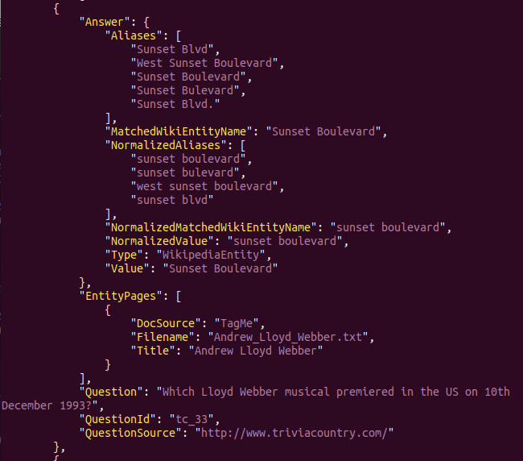
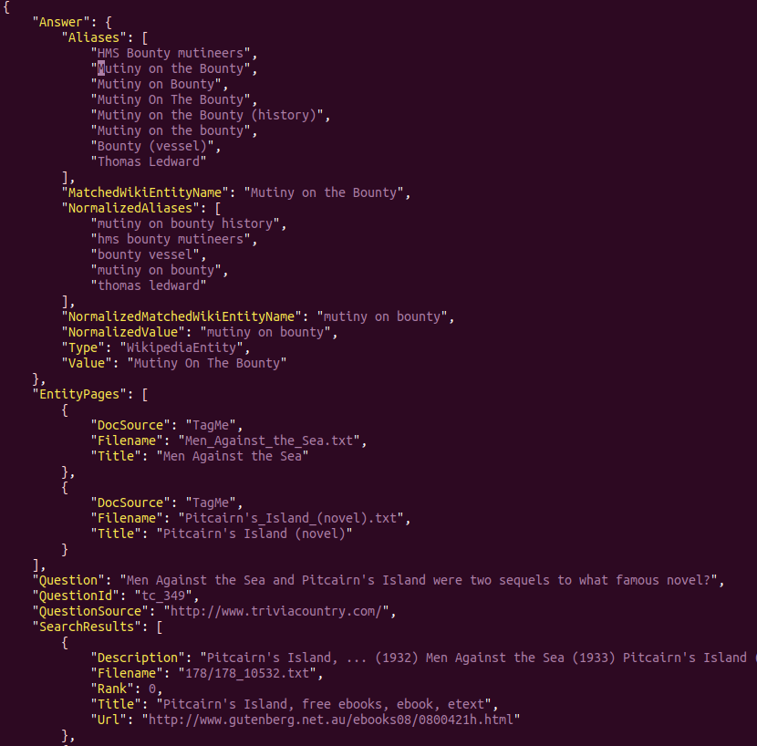
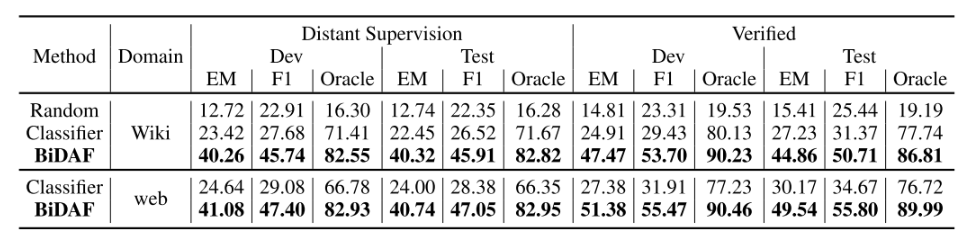
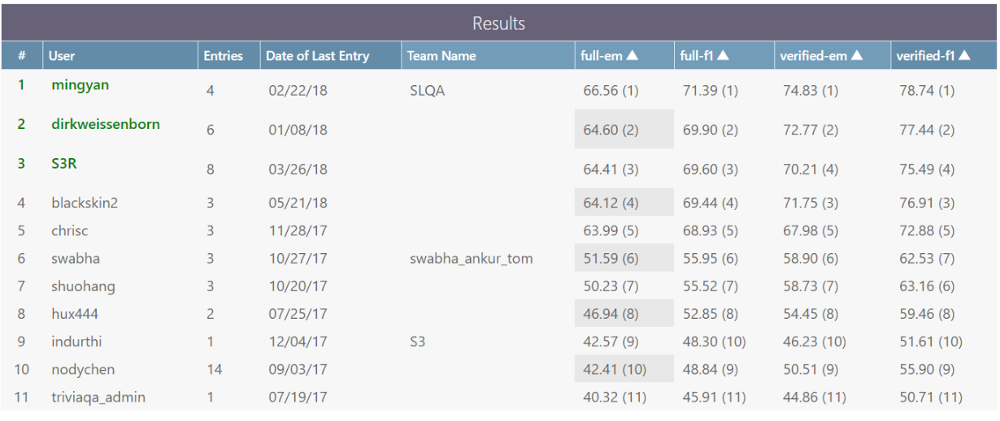
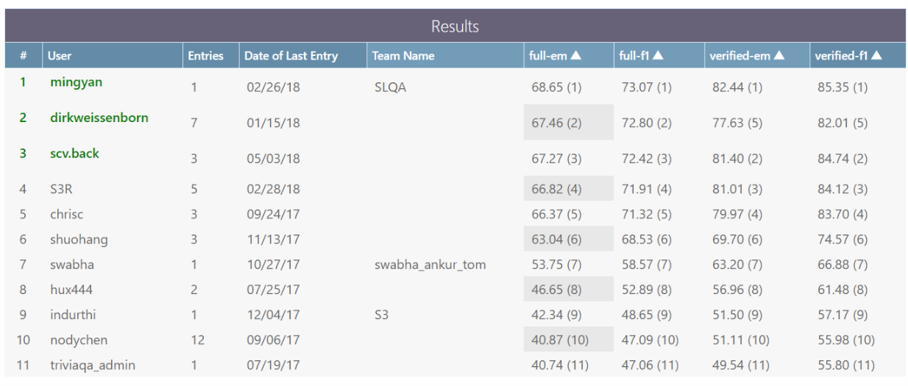

从16年发布的SQuAD语料之后，阅读理解领域的相关研究取得了突飞猛进的发展，在SQuAD语料上，多个模型效果超越人类性能指标。随后，有多个阅读理解语料(MSMARCO/DuReader/TriviaQA)被提出,在SQuAD语料基础上进一步拓宽了阅读理解任务的复杂度（场景或问题越加贴近实际场景），今天我主要对TriviaQA语料进行分析。([论文链接][1], [数据下载][2])
<!-- more -->
## 统计
size:  650k+ （问题-答案-证据），平均每个问题对应6个证据，证据来源于wiki和web。

具有以下特征：
> * 问题组成相对复杂
> * 在问题和答案证据之间有相当大的句法和词法差异
> * 需要更多句子的交叉推理才能找到答案

|统计||
|--------    | :---: |
|QA对总数    | 95956 |
|答案唯一个数| 40478 |
|证据文本个数| 662659 |
|问题平均长度| 14  |
|文本平均长度| 2895|

针对200个样例做的**问题统计分析**：

|属性|样例|统计|
|:--------:|:-----:|:---:|
|实体/问题|Which politician won the **Nobel Peace Prize** in 2009?|1.77/每个问题|
|包含描述答案所属细粒度类别短语|What **fragrant essential oil** is obtained from Damask Rose?|73.5%|
|包含描述答案粗粒度类别短语|**Who** won the Nobel Peace Prize in 2009?|15.5%|
|涉及时间推理|What was photographed for the first time in **October 1959**|34%|
|含有比较|What is the appropriate name of the **largest** type of frog?|9%|

针对200个样例做的**答案统计分析**：

|类型|比例|
|:---:|:---:|
|数字型|4.17|
|自由文本|2.98|
|维基百科标题|92.85|
|人|32|
|地点|23|
|组织|5|
|杂项|40|

针对**证据文本的统计分析**

|描述|解释|wiki|web|
|--|:--:|:-:|:-:
|词形变异(同义词)|问题与答案之间的主要对应关系是同义词|41% |39%|
|词形变异|问题与文件之间的主要对应关系需要常识或外部知识|17%|17%
|句法变化|在将问题解释为陈述形式之后，其句法依赖性结构不匹配答案句子的结构|69%|65%
|多句子|需要多句子推理|40%|35%
|列表/表格|答案在列表/表格之中|0|7%

语料具体形式：

> * Answer:
>> Value: 从trivia网站获得的答案
>> Aliases(别名): 别名列表（来自Wikipedia和其他来源）。
>> NormalizedAliases(标准化别名): 上述的标准化的变体。如果预测答案属于此列表，则认为它是完全匹配的。
>> Type: 数字，Wikipedia实体或FreeForm
>> MatchedWikiEntityName: 仅在类型为WikipediaEntity时出现
>> NormalizedMatchedWikiEntityName: 仅在类型为WikipediaEntity时出现
> * EntityPages: 该问题的维基百科文档列表
>> DocSource：search / tagme
>> Filename: Filename in "evidence/wikipedia" directory
>> Title: Wikipedia page title
> * Question
> * QuestionId: 问题的唯一字母数字标识
> * QuestionSource: 该问题被抓取的网站
> * SearchResults: 包含答案实体的检索网页列表
>> Description: 搜索片段
>> Filename: 
>> Rank: 搜索输出排序
>> Title: 页面标题
>> Url: 网页链接

具体样例如下：

文件格式如下：

> trivia:
>> qa:
>>> verified-web-dev.json: 论文中提及的人工标注的verified数据集
>>> verified-wikipedia-dev.json: 同上
>>> web-dev/train.json: 证据文件来源于搜索引擎
>>> wikipedia-dev/train.json: 证据文件来源于wiki
>>> web/wiki-test-without-answers.json: 测试集
>> evidence:
>>> wikipedia: 维基百科数据
>>> web: 爬取的相关网页

## 实验分析：
论文中给出了基于传统机器学习（分类器）和深度学习（BiDAF）的两种方法，并且给出了对比。实验性能如下图：

除了论文给出的baseline实验结果，在[官方][3]的榜单上，已经有很多团队做出了相应的成果，下面是实验榜单最新(当前时间)的结果：

  [1]: http://xueshu.baidu.com/s?wd=paperuri:%2859ed6bbc099f6f36ad42377caf807346%29&filter=sc_long_sign&tn=SE_xueshusource_2kduw22v&sc_vurl=http://arxiv.org/abs/1705.03551&ie=utf-8&sc_us=10216672048524353352
  [2]: http://nlp.cs.washington.edu/triviaqa/
  [3]: https://competitions.codalab.org/competitions/17208#results