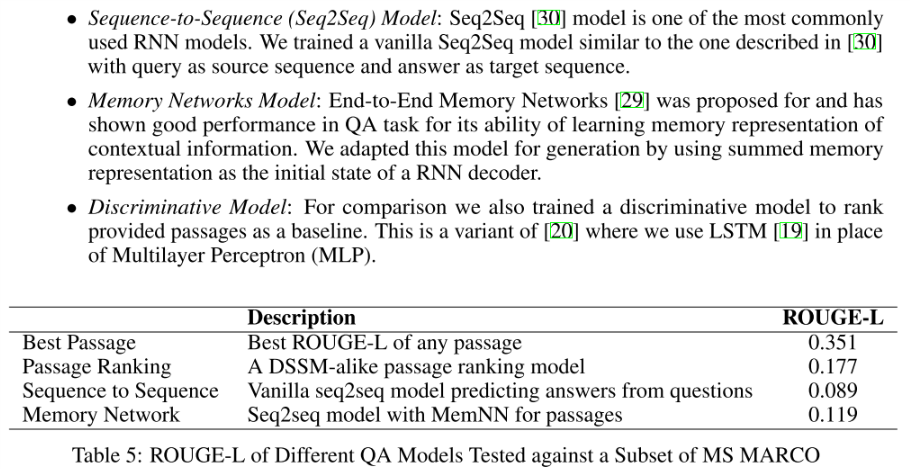
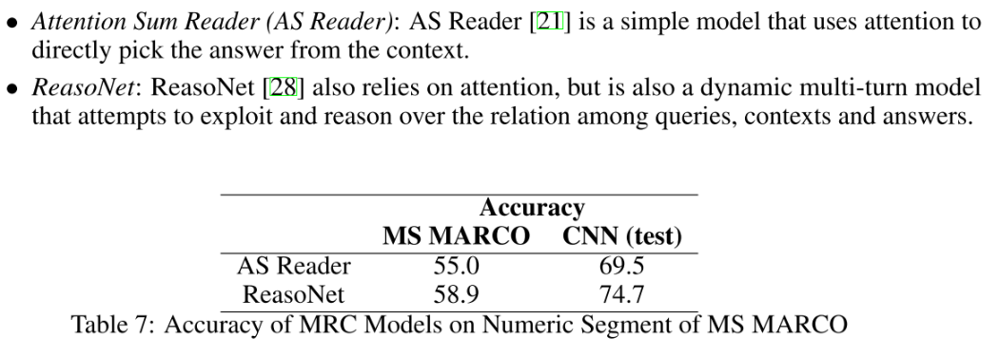
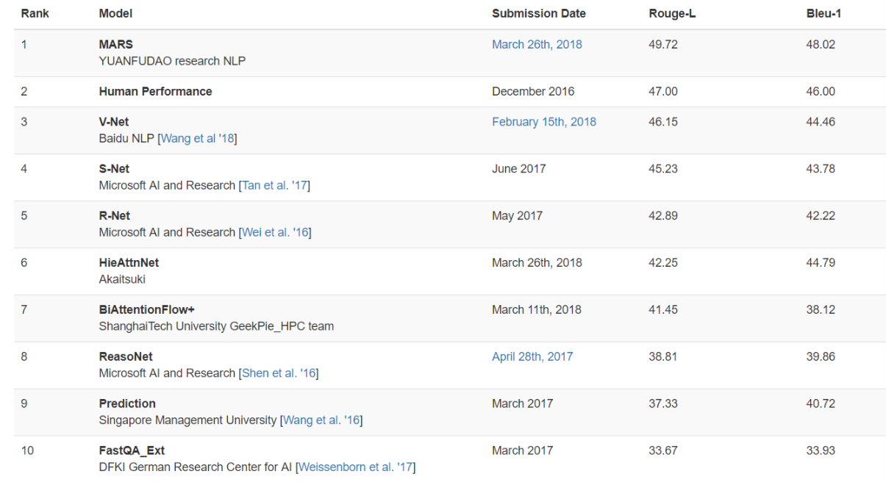

## 概要
MSMARCO 是微软在2016年发布的阅读理解语料，该语料是在squad提出之后发布的，所以该语料可以说进一步突破了squad语料在阅读理解任务上的一些限制，例如，MSMARCO语料对于一个问题有多个相关的文本段落，而squad语料每个问题对应一个确定的文本段落。
<!-- more -->
MARCO是微软基于搜索引擎BING构建的大规模英文阅读理解数据集，包含10万个问题和20万篇不重复的文档。MARCO数据集中的问题全部来自于 BING 的搜索日志，根据用户在BING 中输入的真实问题模拟搜索引擎中的真实应用场景，是该领域最有应用价值的数据集之一。([官方][1])

## 语料众览 
特征：
> * 所有问题都是真实的，匿名用户查询发布到必应搜索引擎，问题不会很简明，可能比较模糊。
> * 相关段落是来自网页
> * 所有答案是人给出的
> * 部分问答有多个答案
> * 部分问题没有答案
> * 所有的问题都有标注信息(查询意图：数字，实体，地点，人物，描述)
> * 每个问题对应10个段落，这10个段落是有排序的。
> * 论文中提到数据生成时做了质量控制，对于那些人也无法确定的问题做了控制。

数据的构建处理：
> 1. 问题：训练分类器筛选合适的问题
> 2. 段落：通过一个IR机器学习系统挑选
> 3. 答案：人工判断生成
> 4. 查询意图标注：标注使用训练的多类别svm分类器，测试性能准确率为90.31%

统计信息：
1. 针对问题类型的统计信息

|Query包含|比例 %|
|:---:|:---:|
|what|42.2|
|how|15.3|
|where|4.4|
|when|2.0|
|why|1.8|
|who|1.7|
|which|1.4|

2. 针对答案类型的统计分布

|anser 类型| 问题占比 %|
|:---:|:---:|
|描述|52.6|
|数字|28.4|
|实体|10.5|
|地点|5.7|
|人物|2.7|

## 论文实验分析
### 数据现象 
论文中提出答案类型不同的问题有着不一样现象：
> * Yes/No的问题简单的二元分类
> * 实体类的问题答案一般是短语
> * 描述类哦问题答案一般比较长，需要多段落推理

针对上述现象，论文中提出，针对不同的类别使用不同的评价方法
> * 使用ACC prf来评价数字类型的问题答案
> * ROUGE-L和[phrasing-aware][2]评价框架 来评价答案长的问题

### 实验
论文使用了两种类型的方法做了实验，分别是生成模型和完型填空语料上的模型
**生成模型实验**：

**完型模型**

现有榜单性能：

### 补充
微软在初始发布了10W条的数据，在2018年4月23号又发布了100W级别的数据。

[1]: http://www.msmarco.org/dataset.aspx
[2]: https://www.microsoft.com/en-us/research/publication/proposal-evaluating-answer-distillation-web-data/